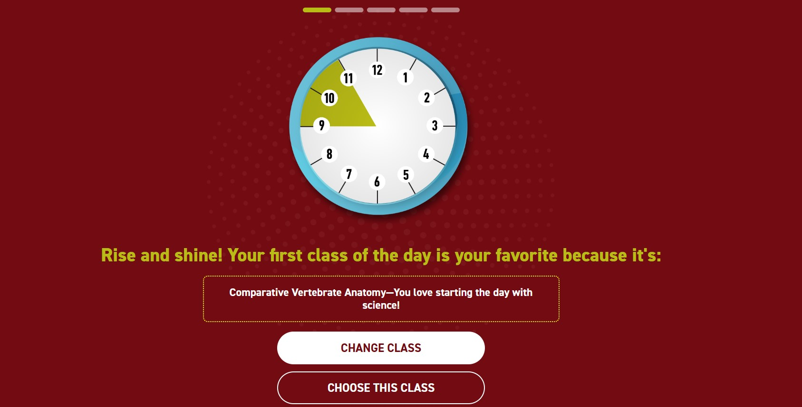

# Schedule Randomizer

A schedule randomizer built with **HTML, CSS, and JavaScript**. It lets users generate randomized schedule options and quickly re-roll until they land on something they like.

## Features
- Randomizes schedule options with one click
- Clean, responsive layout for desktop and mobile
- Simple, readable code structure (no frameworks)

## Built With
- HTML5
- CSS3
- JavaScript (ES6)

## How It Works (High Level)
- A list/array of schedule items is stored in JavaScript
- Clicking **Change Class** selects items at random and updates the DOM
- Clicking **Choose This Class** locks in the choice and progresses to the next step
- The UI updates without page reloads
- All choices are shown on a final page

## Getting Started (Run Locally)
1. Download or clone the repo
2. Open `index.html` in your browser  

## What This Demonstrates
This project highlights my ability to:
- Build interactive UI with vanilla JavaScript
- Manipulate the DOM cleanly and predictably
- Organize front-end projects with a professional repo structure

## Future Improvements
- Save “locked” schedules to LocalStorage
- Add editable schedule items in the UI
- Add accessibility enhancements (ARIA labels, keyboard support)

## Author
Matthew Wolford  
